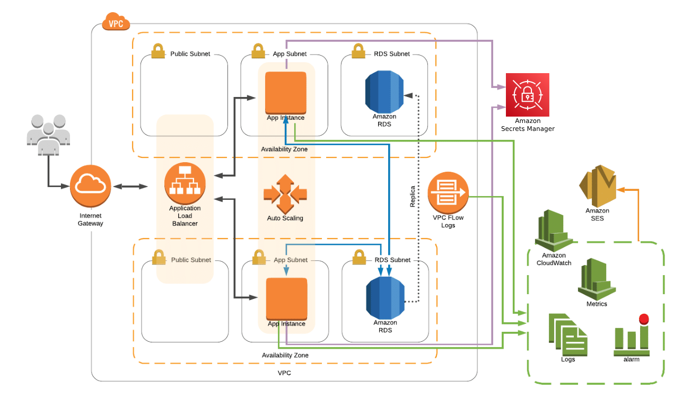

# AWS Infrastructure with Terraform

This project is my first hands-on experience with AWS and Terraform, where I practiced building a complete infrastructure on AWS using Terraform. The main objective was to create a secure and scalable infrastructure for a web application with networking, compute, database, and monitoring layers.

## Project Overview

The infrastructure consists of the following key components:
- **S3 bucket** for storing the Terraform remote state.
- **DynamoDB** for state locking to prevent concurrent modifications.
- **VPC** with multiple subnets for different layers: Load Balancer, Application, and Database.
- **Auto Scaling Group** for application instances with bootstrapping to install and configure WordPress.
- **RDS** for the database layer.
- **ALB** for distributing traffic.
- **CloudWatch** for logging and custom metrics.
- **SNS** for notifications when certain conditions are met.



---

## Steps I followed:

### 1. Setup Terraform Backend

- **Create an S3 bucket** to store the Terraform remote state file.
- **Create a DynamoDB table** for state locking to avoid race conditions.
- **Update the Terraform configuration** to store the state file in the S3 bucket and configure state locking with DynamoDB.

### 2. Networking Layer

1. **VPC Creation**:
   - Created a Virtual Private Cloud (VPC) to house all resources.

2. **Subnets**:
   - Created 6 subnets across two Availability Zones (AZs):
     - Public subnets for Load Balancer.
     - Private subnets for Application instances.
     - Private subnets for RDS database.

3. **Internet Gateway (IGW)**:
   - Added an Internet Gateway for public subnets to allow internet access.

4. **NAT Gateway**:
   - Set up a NAT Gateway to allow private application instances to access the internet for updates without exposing them.

5. **Routing Tables**:
   - Created routing tables for public and private subnets.
   - Configured the default route for public subnets to point to the IGW.
   - Configured private subnet routes to use the NAT Gateway (for the Application subnet only).

6. **Security Groups**:
   - Defined security groups for the Load Balancer, Application instances, and RDS with appropriate rules.

### 3. Load Balancer (ALB)

- Deployed an **Application Load Balancer (ALB)** in the public subnets to balance traffic between application instances.

### 4. Database Layer (RDS)

- Created an **RDS Subnet Group** for the database.
- Provisioned an **RDS database** with multi-AZ enabled using MySQL.

### 5. Application Layer (EC2)

1. **IAM Role**:
   - Created an IAM role for the application instances with permissions for **CloudWatch Logs** and **Custom Metrics**.

2. **Launch Template**:
   - Created a launch template for the application instances using the latest **Amazon Linux** AMI.
   - Included the IAM role in the launch configuration.
   - Defined bootstrapping in the **user data** to:
     - Install and configure **Apache** with **PHP**.
     - Install and set up **WordPress** using the RDS database.
     - Install and configure **CloudWatch Agent** to send logs and custom metrics (disk and memory usage) to CloudWatch.

3. **Auto Scaling Group (ASG)**:
   - Created an Auto Scaling Group spanning two AZs, with a minimum and maximum count of 2 instances.
   - Integrated the load balancer with the ASG to distribute incoming traffic.

### 6. Monitoring & Alarms

1. **CloudWatch Alarms**:
   - Created three CloudWatch alarms for monitoring the following metrics:
     - CPU usage above 80%.
     - Disk usage above 80%.
     - Memory utilization above 80%.

2. **SNS Topic**:
   - Created an SNS topic for alarm notifications.
   - Subscribed my email to receive notifications from the alarms.

---

## How to Run This Project

1. Clone this repository.
2. Configure the "backends.tf" to create your own bucket for storing the state file and statelock. Then comment it out or delete it.
3. Ensure you have AWS CLI configured with appropriate credentials.
4. Run `terraform init` to initialize the Terraform configuration.
5. Comment out the "cloudwatch-alarms" module.
6. Apply the Terraform configuration:
   ```bash
   terraform apply
7. Uncomment the "cloudwatch-alarms" module.
8. Apply the Terraform configuration:
   ```bash
   terraform apply